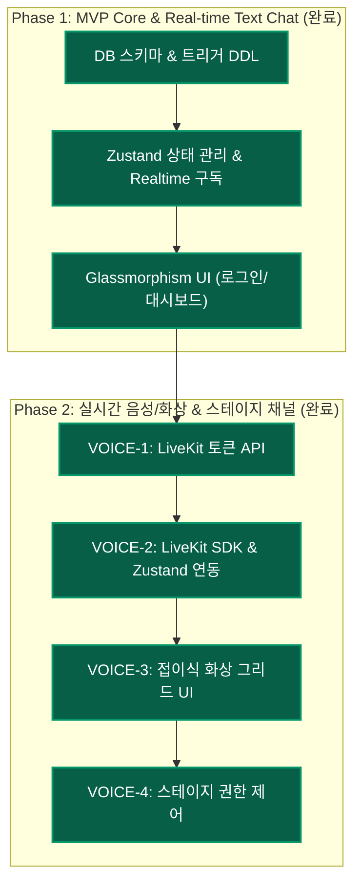

# ISSUE TRACKER & WAYFINDER MAP

## 🗺️ Issue #1: Wayfinder Map (Project Roadmap)
- **상태**: ✅ 완료 (Completed)
- **내용**: 프로젝트의 개발 주기(AI Hero 7 Phases) 및 전체적인 Vertical Slice들의 진행 상황을 추적하고 가이드라인을 제공하는 로드맵 맵입니다.
- **맵 현황**:

---

## 📋 등록된 이슈 목록 (Registered Issues)

### 🟢 Phase 1: MVP Core & Real-time Text Chat (Completed)

#### **Issue #2: [DB-1] Supabase 스키마 DDL 작성**
- **상태**: ✅ 완료 (Resolved)
- **설명**: `profiles`, `spaces`, `categories`, `channels`, `members`, `messages` 테이블 DDL 작성 및 외래키 정렬.

#### **Issue #3: [DB-2] 신규 회원 가입용 프로필 생성 트리거**
- **상태**: ✅ 완료 (Resolved)
- **설명**: `auth.users` 가입 시 `profiles` 테이블에 자동 동기화 트리거 추가.

#### **Issue #4: [DB-3] RLS 정책 활성화 및 설정**
- **상태**: ✅ 완료 (Resolved)
- **설명**: 스페이스 멤버십 기반 데이터 조회/작성 차단 RLS 정책 설계.

#### **Issue #5: [LOGIC-1] Zustand Store 설계 및 구축**
- **상태**: ✅ 완료 (Resolved)
- **설명**: 스페이스 목록, 채널 목록, 메시지 전역 상태 관리 구현.

#### **Issue #6: [LOGIC-2] Supabase Realtime & Presence 연결 훅**
- **상태**: ✅ 완료 (Resolved)
- **설명**: 실시간 메시징 수신 및 온라인 상태 Presence 동기화 훅 작성.

#### **Issue #7: [UI-1] 로그인 및 회원가입 페이지**
- **상태**: ✅ 완료 (Resolved)
- **설명**: 이메일/패스워드 기반 프리미엄 다크 모드 폼 퍼블리싱.

#### **Issue #8: [UI-2] 메인 대시보드 레이아웃 퍼블리싱**
- **상태**: ✅ 완료 (Resolved)
- **설명**: 스페이스 선택 바, 채널/카테고리 바, 멤버 목록, 채팅창 그리드 구현.

#### **Issue #9: [UI-3] 스페이스 생성 및 초대 링크 팝업 모달**
- **상태**: ✅ 완료 (Resolved)
- **설명**: 신규 스페이스 및 기본 채널 생성 폼, 초대 코드 클립보드 복사 UI 구축.

#### **Issue #10: [UI-4] 실시간 채팅방 컴포넌트**
- **상태**: ✅ 완료 (Resolved)
- **설명**: 실시간 피드 렌더링, 메시지 전송 인풋 바 및 오토 스크롤 구현.

---

### 🔵 Phase 2: 실시간 음성/화상 통화 & 스테이지 채널 (Completed)

#### **Issue #11: [VOICE-1] LiveKit 토큰 생성 API Route 구현**
- **상태**: ✅ 완료 (Resolved)
- **설명**: `src/app/api/livekit/token/route.ts` 구현 및 세션/멤버십 권한 검증 완료.

#### **Issue #12: [VOICE-2] LiveKit HTML5 SDK 연동 및 Zustand 상태 확장**
- **상태**: ✅ 완료 (Resolved)
- **설명**: `livekit-client` 패키지 연동 및 활성 음성 채널 입장/퇴장 액션 상태 추가 완료.

#### **Issue #13: [VOICE-3] 접이식 Collapsible Voice/Video 그리드 UI 구현**
- **상태**: ✅ 완료 (Resolved)
- **설명**: 채팅방 상단에 비디오/오디오 참여자 그리드 구현 및 접기/펴기 슬라이드 애니메이션 적용 완료.

#### **Issue #14: [VOICE-4] Stage Channel 전용 UI 권한 분기 및 마이크 상태 제어**
- **상태**: ✅ 완료 (Resolved)
- **설명**: 스테이지 채널 내 ADMIN/OWNER 발언(Publish) 기능 제어 및 일반 MEMBER 음소거 청취 적용 완료.
