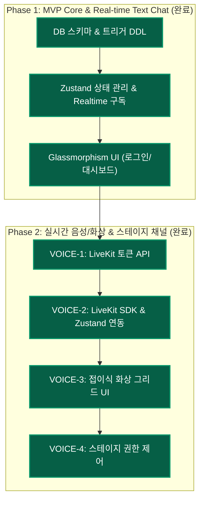

# ISSUE TRACKER & WAYFINDER MAP

## 🗺️ Issue #1: Wayfinder Map (Project Roadmap)
- **상태**: ✅ 완료 (Completed)
- **내용**: 프로젝트의 개발 주기(AI Hero 7 Phases) 및 전체적인 Vertical Slice들의 진행 상황을 추적하고 가이드라인을 제공하는 로드맵 맵입니다.
- **맵 현황**:

```mermaid
graph TD
    classDef done fill:#065f46,stroke:#059669,stroke-width:2px,color:#fff;
    classDef active fill:#1e3a8a,stroke:#3b82f6,stroke-width:2px,color:#fff;
    classDef pending fill:#27272a,stroke:#52525b,stroke-width:2px,color:#a1a1aa;

    subgraph Phase1["Phase 1: MVP Core & Real-time Text Chat (완료)"]
        P1_DB["DB 스키마 & 트리거 DDL"]:::done
        P1_STATE["Zustand 상태 관리 & Realtime 구독"]:::done
        P1_UI["Glassmorphism UI (로그인/대시보드)"]:::done
        P1_DB --> P1_STATE --> P1_UI
    end

    subgraph Phase2["Phase 2: 실시간 음성/화상 & 스테이지 채널 (완료)"]
        P2_API["VOICE-1: LiveKit 토큰 API"]:::done
        P2_STATE["VOICE-2: LiveKit SDK & Zustand 연동"]:::done
        P2_UI["VOICE-3: 접이식 화상 그리드 UI"]:::done
        P2_PERM["VOICE-4: 스테이지 권한 제어"]:::done
        P2_API --> P2_STATE --> P2_UI --> P2_PERM
    end

    P1_UI --> P2_API
```

---

## 📋 등록된 이슈 목록 (Registered Issues)

### 🟢 Phase 1: MVP Core & Real-time Text Chat (Completed)

#### **Issue #2: [DB-1] Supabase 스키마 DDL 작성**
- **상태**: ✅ 완료 (Resolved)
- **설명**: `profiles`, `spaces`, `categories`, `channels`, `members`, `messages` 테이블 DDL 작성 및 외래키 정렬.

#### **Issue #3: [DB-2] 신규 회원 가입용 프로필 생성 트리거**
- **상태**: ✅ 완료 (Resolved)
- **설명**: `auth.users` 가입 시 `profiles` 테이블에 자동 동기화 트리거 추가.

#### **Issue #4: [DB-3] RLS 정책 활성화 및 설정**
- **상태**: ✅ 완료 (Resolved)
- **설명**: 스페이스 멤버십 기반 데이터 조회/작성 차단 RLS 정책 설계.

#### **Issue #5: [LOGIC-1] Zustand Store 설계 및 구축**
- **상태**: ✅ 완료 (Resolved)
- **설명**: 스페이스 목록, 채널 목록, 메시지 전역 상태 관리 구현.

#### **Issue #6: [LOGIC-2] Supabase Realtime & Presence 연결 훅**
- **상태**: ✅ 완료 (Resolved)
- **설명**: 실시간 메시징 수신 및 온라인 상태 Presence 동기화 훅 작성.

#### **Issue #7: [UI-1] 로그인 및 회원가입 페이지**
- **상태**: ✅ 완료 (Resolved)
- **설명**: 이메일/패스워드 기반 프리미엄 다크 모드 폼 퍼블리싱.

#### **Issue #8: [UI-2] 메인 대시보드 레이아웃 퍼블리싱**
- **상태**: ✅ 완료 (Resolved)
- **설명**: 스페이스 선택 바, 채널/카테고리 바, 멤버 목록, 채팅창 그리드 구현.

#### **Issue #9: [UI-3] 스페이스 생성 및 초대 링크 팝업 모달**
- **상태**: ✅ 완료 (Resolved)
- **설명**: 신규 스페이스 및 기본 채널 생성 폼, 초대 코드 클립보드 복사 UI 구축.

#### **Issue #10: [UI-4] 실시간 채팅방 컴포넌트**
- **상태**: ✅ 완료 (Resolved)
- **설명**: 실시간 피드 렌더링, 메시지 전송 인풋 바 및 오토 스크롤 구현.

---

### 🔵 Phase 2: 실시간 음성/화상 통화 & 스테이지 채널 (Completed)

#### **Issue #11: [VOICE-1] LiveKit 토큰 생성 API Route 구현**
- **상태**: ✅ 완료 (Resolved)
- **설명**: `src/app/api/livekit/token/route.ts` 구현 및 세션/멤버십 권한 검증 완료.

#### **Issue #12: [VOICE-2] LiveKit HTML5 SDK 연동 및 Zustand 상태 확장**
- **상태**: ✅ 완료 (Resolved)
- **설명**: `livekit-client` 패키지 연동 및 활성 음성 채널 입장/퇴장 액션 상태 추가 완료.

#### **Issue #13: [VOICE-3] 접이식 Collapsible Voice/Video 그리드 UI 구현**
- **상태**: ✅ 완료 (Resolved)
- **설명**: 채팅방 상단에 비디오/오디오 참여자 그리드 구현 및 접기/펴기 슬라이드 애니메이션 적용 완료.

#### **Issue #14: [VOICE-4] Stage Channel 전용 UI 권한 분기 및 마이크 상태 제어**
- **상태**: ✅ 완료 (Resolved)
- **설명**: 스테이지 채널 내 ADMIN/OWNER 발언(Publish) 기능 제어 및 일반 MEMBER 음소거 청취 적용 완료.

---

### 🟡 Phase 3: 전역 실시간 파이프라인 & 디스코드 스타일 2단 사이드바 레이아웃 (In Progress)

#### **Issue #15: [REALTIME-1] 단일 전역 SSE 스트림 (/api/events/stream) 파이프라인 구축**
- **상태**: 🟡 진행 예정 (Open)
- **설명**: 채팅, DM, 친구 요청, 알림, Presence 이벤트를 단일 전역 SSE 스트림으로 통합 발행/수신하는 아키텍처 구축.

#### **Issue #16: [UI-LAYOUT-1] 디스코드 스타일 2단 사이드바 (64px 세로바 + 240px 패널) 개편**
- **상태**: 🟡 진행 예정 (Open)
- **설명**: 상단 드롭다운 제거, 최좌측 64px 아이콘 세로바(친구/DM + 스페이스 목록) 및 240px 상세 패널 2단 레이아웃 개편.

#### **Issue #17: [UI-MOBILE-1] 모바일 검은 화면 수정 및 상단 햄버거 반응형 드로어 구현**
- **상태**: 🟡 진행 예정 (Open)
- **설명**: 모바일/PC 사이드바 닫힌 시 검은 화면만 출력되는 문제 해결 및 상단 햄버거(☰) 헤더 기반 반응형 슬라이드 드로어 구축.

#### **Issue #18: [FRIENDS-1] 실시간 친구 요청 보냄/수락 동기화 및 대기 목록 갱신**
- **상태**: 🟡 진행 예정 (Open)
- **설명**: 친구 요청 수신 시 대기 목록/배지 즉시 +1 갱신 및 수락 시 페이지 새로고침 없이 양쪽 유저 화면의 '친구 목록/온라인' 탭으로 즉시 이동 및 1:1 DM 버튼이 활성화.

#### **Issue #19: [DM-1] 실시간 1:1 DM 메시지 수발신 및 실시간 알림 연동**
- **상태**: 🟡 진행 예정 (Open)
- **설명**: DM 메시지 전송 시 상대방 UI 및 알림 드로어/배지에 실시간 즉시 반영되도록 구현.

#### **Issue #20: [BADGE-1] 스페이스/친구/개별 DM 세분화 배지 수신 및 자동 읽음 처리**
- **상태**: 🟡 진행 예정 (Open)
- **설명**: 최좌측 친구/DM 아이콘, 각 스페이스 아이콘, 개별 DM 목록 항목에 미읽음 배지 수 표시 및 해당 채널/DM 입장 시 배지 차감/소멸 처리.

#### **Issue #21: [REALTIME-2] 실시간 채팅 수발신 동기화 및 백그라운드 폴링 백업 보강**
- **상태**: 🟡 진행 예정 (Open)
- **설명**: SSE 연결 단락 시 3-5초 간격 백그라운드 폴링 자동 전환 및 채팅 메시지 실시간 렌더링 안정성 보강.

#### **Issue #64: [VOICE-STT-1] FEAT-VOICE_STT_SUMMARY: 음성 채널 백그라운드 STT 파싱, 멀티 AI 요약 및 회의록 DB/히스토리 탭**
- **상태**: 🟡 진행 예정 (Open)
- **설명**: 음성/수업 채널 백그라운드 STT 실시간 텍스트 파싱, Gemini 2.5 Flash / Groq 멀티 AI 요약 연동 및 회의록 DB 저장 및 히스토리 탭/다운로드 구현.

#### **Issue #67: [AUTH-GOOGLE-1] 자체 백엔드(Prisma) 연동 Google OAuth 2.0 로그인 기능 추가**
- **상태**: ✅ 완료 (Resolved)
- **설명**: Supabase Auth 의존 없이 자체 백엔드(Prisma + Next.js Session) 환경에서 구글 계정으로 로그인 및 신규 계정 자동 생성을 지원하는 Google OAuth 2.0 연동 기능 구현.

---

### 🔴 Phase 4 Sprint A: UX 버그 수정 & 실제 기능화 (2026-07-28)

#### **Issue #100: [VOICE-UX-1] 음성채널 모드별 UI 분기 미구현**
- **상태**: ✅ 완료 (Resolved)
- **설명**: GENERAL(자유소통) 모드에서도 발언신청, 신청자 목록 버튼이 모든 모드에 표시되는 문제. 각 channelMode(GENERAL/MEETING/LECTURE)에 맞는 UI를 조건부 렌더링으로 분리.

#### **Issue #101: [MOBILE-1] 모바일/태블릿 사이드바 닫기 불가**
- **상태**: ✅ 완료 (Resolved)
- **설명**: 768px 이하 모바일, 1024px 이하 태블릿에서 사이드바가 열렸을 때 닫을 방법이 없음. backdrop overlay 클릭, 사이드바 내 X 버튼, 채널 선택 시 자동 닫기 구현.

#### **Issue #102: [STUB-1] 음성채널 발언권 관리 가짜 기능 (로컬 state만)**
- **상태**: ✅ 완료 (Resolved)
- **설명**: floorRequests/grantedSpeakers가 로컬 state만 관리되어 실제 다른 참여자의 마이크가 제어되지 않음. LiveKit DataChannel 연동 필요 — 다음 Sprint에서 구현.

#### **Issue #103: [I18N-1] 다국어 키가 VoiceGrid/SettingsModal에 미적용**
- **상태**: ✅ 완료 (Resolved)
- **설명**: catalogs.ts에 한/영 번역 키가 정의되어 있으나, VoiceGrid.tsx 및 SettingsModal.tsx에서 t() 훅을 사용하지 않고 하드코딩. 음성채널 관련 신규 i18n 키 추가 및 적용.

#### **Issue #104: [VOICE-SETTING-1] 마이크 입력 프로필(음성분리/스튜디오) getUserMedia 미반영**
- **상태**: ✅ 완료 (Resolved)
- **설명**: SettingsModal의 inputProfile(isolation/studio/custom) 선택값이 실제 getUserMedia constraints(noiseSuppression, echoCancellation, autoGainControl)에 반영되지 않아 사용자가 효과를 체감할 수 없음.

#### **Issue #105: [DEPLOY-1] deploy.sh Nginx 기반 → Caddy+Let's Encrypt 통합**
- **상태**: ✅ 완료 (Resolved)
- **설명**: 메인 deploy.sh가 Nginx를 설치하도록 되어 있어 Caddy 기반 HTTPS 자동화와 불일치. Caddy를 기본 리버스 프록시로 통합하여 Let's Encrypt 자동 인증서 발급/갱신 지원.

#### **Issue #106: [UI-1] 음성채널 전체화면 버튼 이모지 → Lucide 아이콘 교체**
- **상태**: ✅ 완료 (Resolved)
- **설명**: 전체화면 토글 버튼이 화살표 이모지(↗️/↙️)로 되어있어 의미가 불명확함. Lucide Maximize2/Minimize2 아이콘으로 교체.
